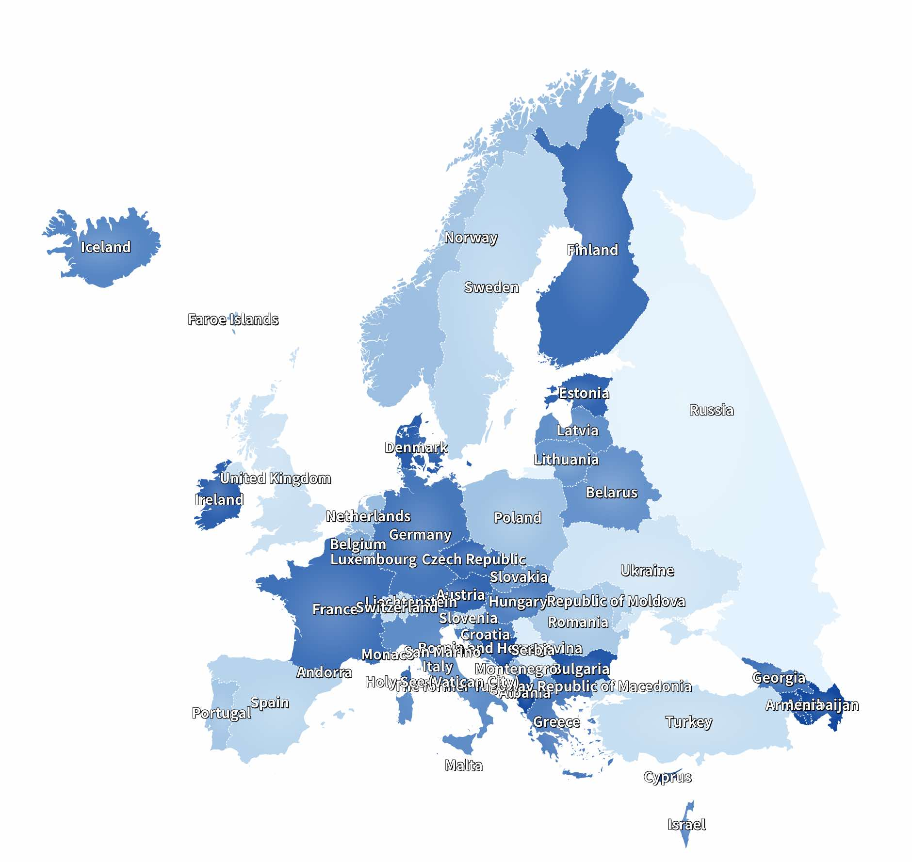
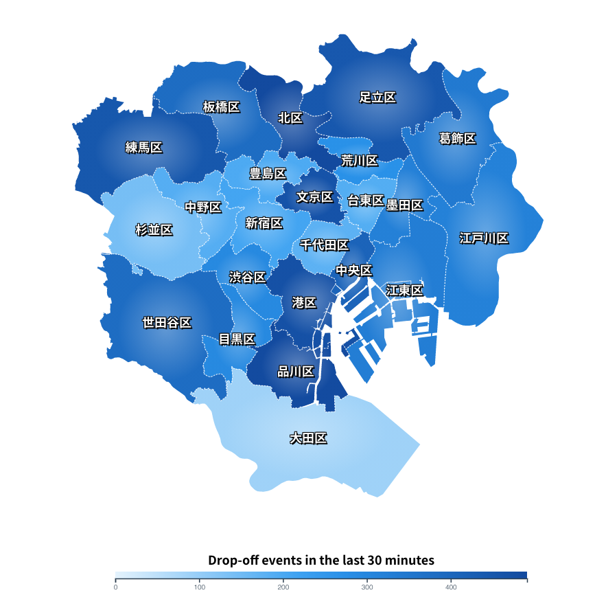
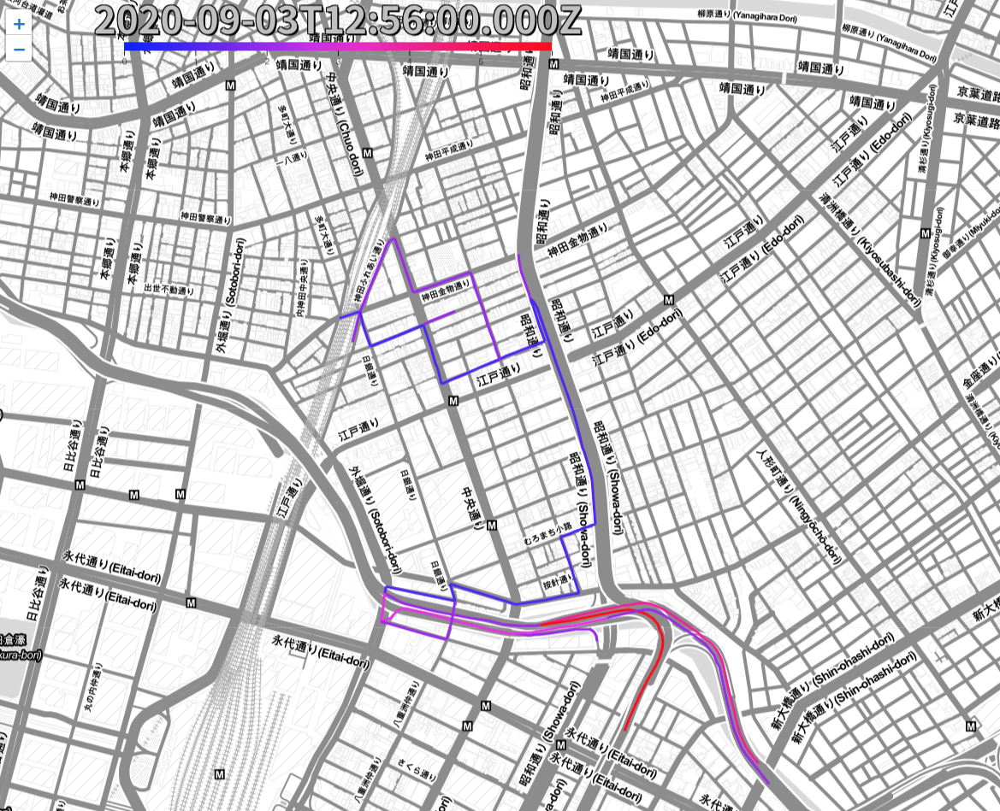

# vue-d3-geo
A d3-geo Vue.js Library.

## What is D3.js?
**D3 (Data-Driven Documents or D3.js) is a JavaScript library for visualizing data using web standards. D3 helps you bring data to life using SVG, Canvas and HTML. D3 combines powerful visualization and interaction techniques with a data-driven approach to DOM manipulation, giving you the full capabilities of modern browsers and the freedom to design the right visual interface for your data.**
[D3.js](https://d3js.org/)

## What is d3-geo?
**D3 uses GeoJSON or TopoJSON to represent geographic features in JavaScript. It provides Geographic projections, shapes and math.**
[d3-geo](https://github.com/d3/d3/blob/master/API.md#geographies-d3-geo)

## What is Vue.js?
**Vue is a progressive framework for building user interfaces. The core library is focused on the view layer only, and is easy to pick up and integrate with other libraries or existing projects.**
[Vue.js](https://vuejs.org)

**To quickly create a Vue.js application please follow this tutorial. After the application is generated as a boilerplate you can easily integrate vue-d3-geo in it.**
[Vue.js](https://cli.vuejs.org/guide/creating-a-project.html#vue-create)

## What is vue-d3-geo?
**It includes d3-geo features and provides several use-cases/examples as Vue.js library. D3.js is pure javascript library and to use it with frameworks like Vue.js, React or Angular it is needed to wrap the library in a certain format of a specific framework.**

## What does vue-d3-geo provide?
**vue-d3-geo does not provide all the features of d3-geo but provide the several features as example. It is recommend to fork this project and generate your own feature**

* D3GeoStatic: Static View will draw single-layer geometry shapes such as a state, a continent. You can use your own geojson/topojson to show anything you want.

* D3GeoDoubleLayer: Static View will draw double-layer geometry shapes such as a continent. By clicking a country in the continent the view will zoom-in to the specific country and to show provinces. Of course your geojson need to contain the countries and the provinces information*

* D3GeoEvents: Events View will draw single-layer or double-layer geometry shapes. The point for this feature is to show event-driven information in a geospatial view such as real-time analytics result visualized on a map as a real-time monitoring dashboard. Please check the demo step below to see some examples with mock-up streaming data. AWS AppSync and AWS IoT can be used in these use cases to feed real-time streaming information to your Vue application - this topic is out of scope and will be provided as another artifact.

* D3GeoLeaf: Draw geometry shapes on top of the Leaflet view. Leaflet is an open-source JavaScript library for interactive maps. The use-cases include drawing a road's or subway's geometry shapes with statistical values. Normally used in monitoring dashboard.

## Some screenshots





## 1. For Users to see the demo(using live-server or host it as a static web app)
## 1-1. Install node.js 12+ and live-server
[node.js installation](https://nodejs.org)
[live-server installation](https://www.npmjs.com/package/live-server)

## 1-2. Clone this repo and run the demo
**live-server command will prompt you the link to call in the browser.**
```
$ cd vue-d3-geo/demo
$ live-server
```

## 2. For Users to use the components

### 2-1. Install 
```
npm install --save vue-d3-geo
```

### 2-2. Add d3-geo components in your vue's template
#### Default single-layer Tokyo map
```
<template>
	<div>
		...

		<d3-geo-static
		  id="01" 
		  topojson-path="data/tokyo_23_blocks_districts_final.json"
		  >    
		</d3-geo-static>

		....
	</div>
</template>
```

#### Default double-layer Tokyo map
```
<template>
	<div>
		...

		<d3-geo-double-layer
		  id="01" 
		  topojson-path="data/tokyo_23_blocks_districts_final.json"
		  >    
		</d3-geo-double-layer>

		....
	</div>
</template>
```

### 2-3. Add d3-geo components in your vue's script
```
<script>
...

import * as d3geo from 'vue-d3-geo';
import 'vue-d3-geo/dist/vue-d3-geo.css';

export default {
	
	...

	components: {
		...

		D3GeoDoubleLayer: d3geo.D3GeoDoubleLayer,
		D3GeoEvents: d3geo.D3GeoEvents,
		D3GeoStatic: d3geo.D3GeoStatic,
	}
}
</script>
```
### 2-4. Use your own maps
* [TopoJSON Guide](./TOPOJSON.md#)
* [Single-layer map API Reference](./API_REF.md#)
* [Double-layer map API Reference](./API_REF.md#)

## 3. For Developers
Fork this repo and add your own components under src/components

### 3-1. Compiles and hot-reloads for development
```
npm run serve
```

### 3-2. Compiles and minifies for production
```
npm run build
```

### 3-3. Lints and fixes files
```
npm run lint
```

### Customization configuration references
* https://qiita.com/coppieee/items/dcf120d6b8eef68ecb34
* https://cli.vuejs.org/guide/build-targets.html
* https://github.com/awaigand/vue-cli-target-lib-example/

--------------

## 4. TODO

http://www.geonet.ch/basic-leaflet-map-with-d3-overlay/
https://shimz.me/blog/d3-js/3517
http://bl.ocks.org/shimizu/749df041c1945aef78fd992c7dfbe0e1
https://travishorn.com/interactive-maps-with-vue-leaflet-5430527353c8

### 4-1. fix mouseover for D3GeoLeaf
https://www.d3-graph-gallery.com/graph/line_cursor.html